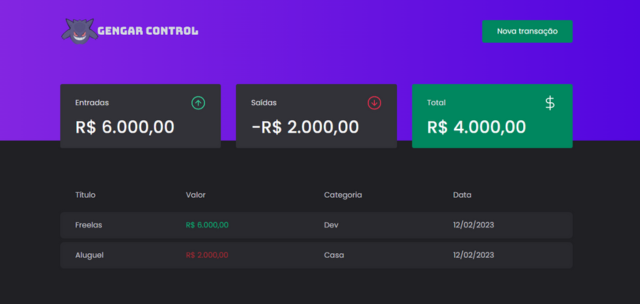

  <h1>Sistema de controle de finanças</h1>
  

	

  <a href="#-tecnologias">Tecnologias</a>&nbsp;&nbsp;&nbsp;|&nbsp;&nbsp;&nbsp;
  <a href="#-projeto">Projeto</a>&nbsp;&nbsp;&nbsp;|&nbsp;&nbsp;&nbsp;
  <a href="#-layout">Layout</a>&nbsp;&nbsp;&nbsp;|&nbsp;&nbsp;&nbsp;
  

 

## 🚀 Tecnologias

Esse projeto foi desenvolvido com as seguintes tecnologias:

- JavaScript/Typescript
- [Node](https://nodejs.org/)
- [ReactJS](https://reactjs.org/)
- [TailwindCSS](https://tailwindcss.com/)
- [Vite](https://vitejs.dev/)
- [Vitest](https://vitest.dev/)
- [Yarn](https://yarnpkg.com/)

## 💻 Projeto

Este projeto trata-se de uma página de controle financeiro. Tendo como principais funcionalidades:

- [x] Validação de Inputs
- [x] Listagem das transações (entradas e saídas)
- [x] Cálculo das entradas, saídas e total
- [x] Campo de busca
- [x] Modal para cadastro de nova transação

---

# 🚀 Autor

- [Leonardo Carvalho](https://www.linkedin.com/in/leocarvalhodev/)
   

# 🚀 Technologies

- [React.js](https://reactjs.org/)
- [Vite.js](https://vitejs.dev/)
- [TypeScript](https://www.typescriptlang.org/)
- [Styled-Components](https://styled-components.com/)
- [React Icons](https://react-icons.github.io/react-icons/)
- [React Query](https://react-query.tanstack.com/)
- [Swiper](https://swiperjs.com/react/)
- [TypewriterJS v2](https://github.com/tameemsafi/typewriterjs/)
- [Eslint](https://eslint.org/)
- [Prettier](https://prettier.io/)

---

Made with 💜 &nbsp;by Leonardo Carvalho 👋 &nbsp;[See my linkedin](https://www.linkedin.com/in/leocarvalhodev/)
